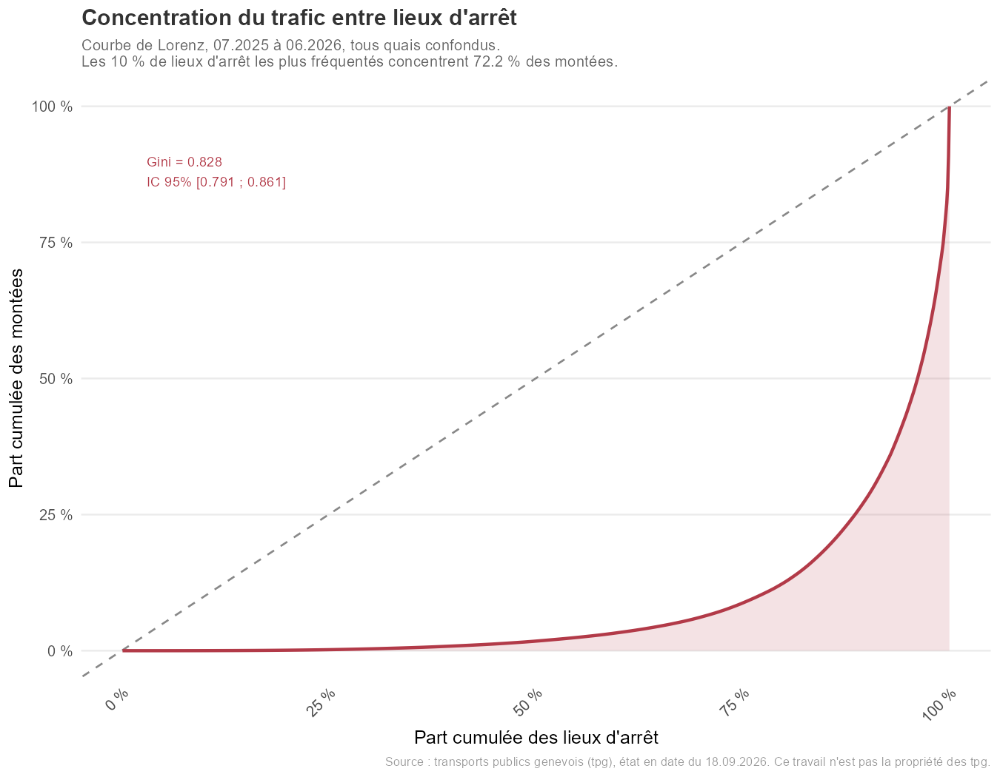
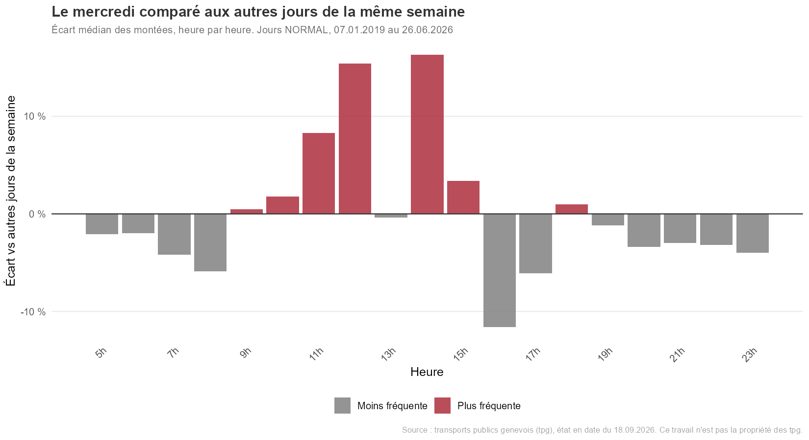
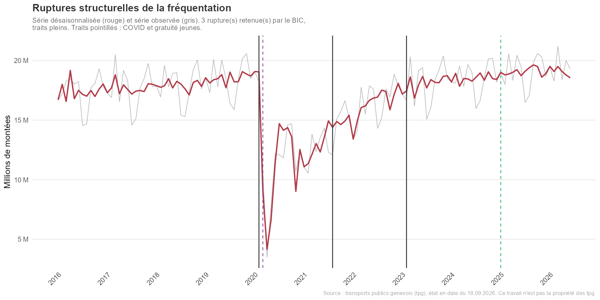
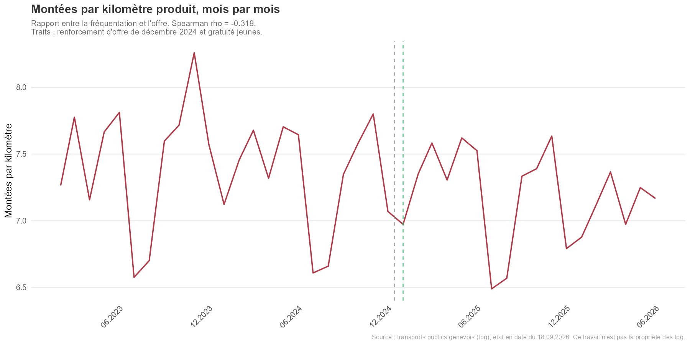
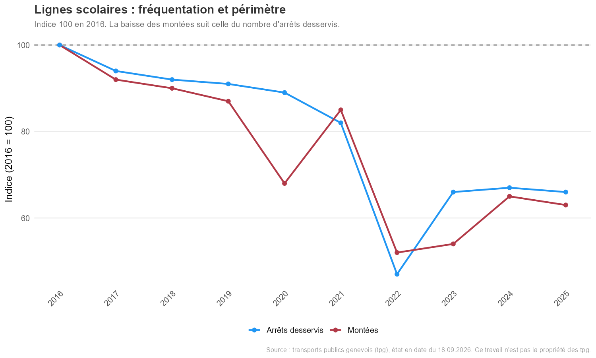
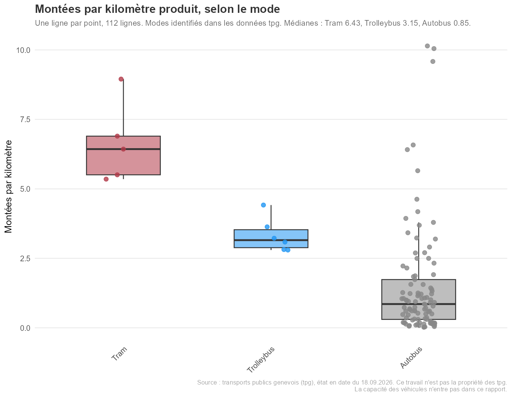
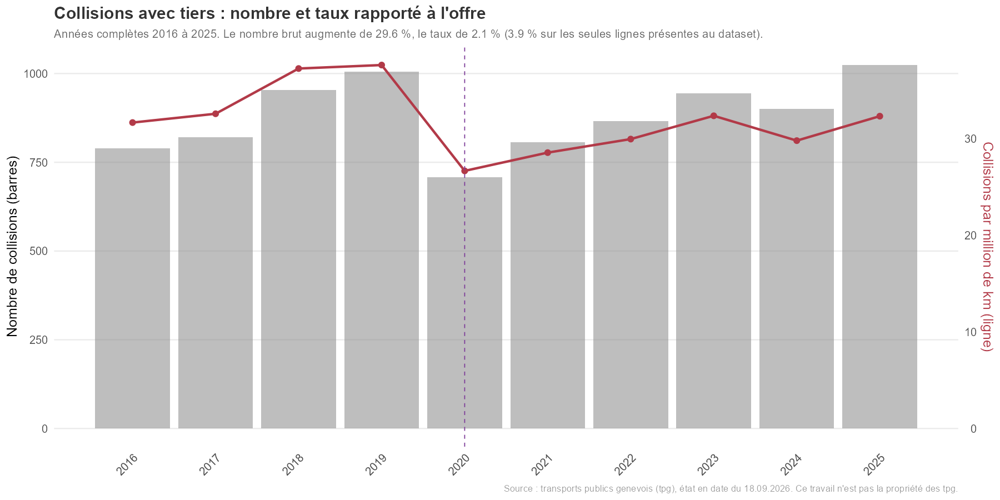
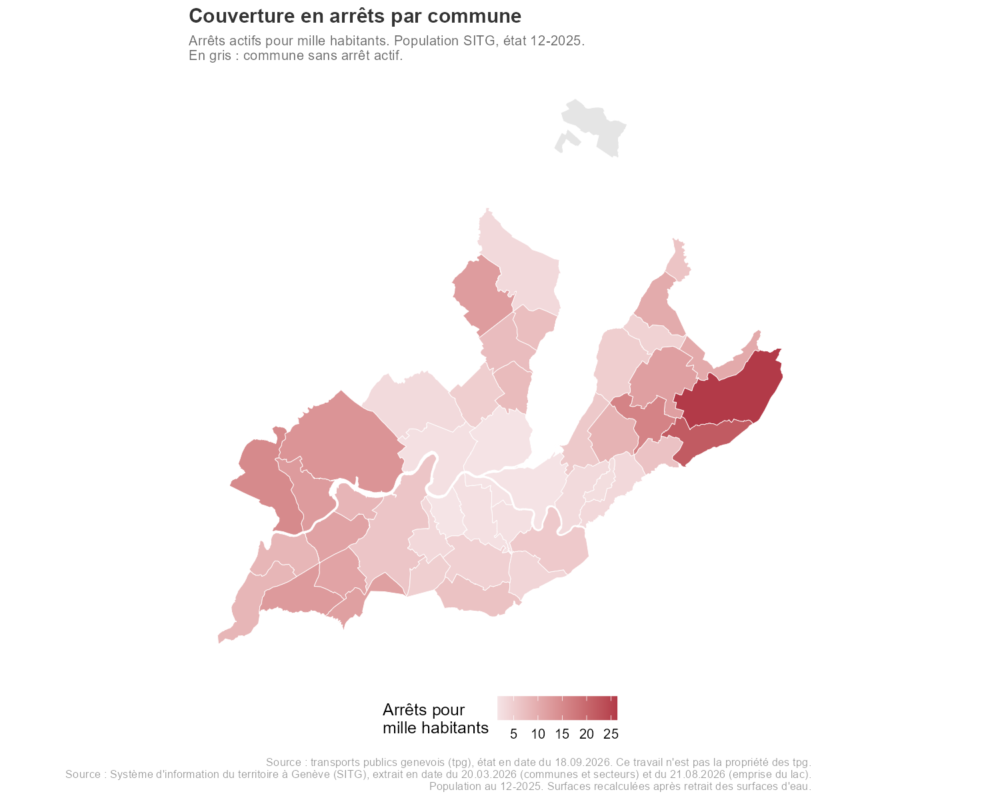
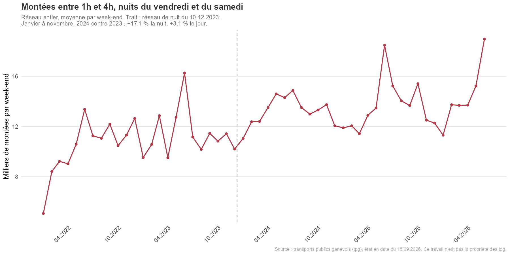

# Données ouvertes et transport public à Genève : une analyse statistique

*Français | [English](#english)*

Analyse statistique des données ouvertes de fréquentation, d'offre et de collisions du réseau de transports publics à Genève, de 2016 à juin 2026.

> Source : transports publics genevois (tpg), état en date du 18.09.2026. Ce travail n'est pas la propriété des tpg.
>
> Couches géographiques : Source : Système d'information du territoire à Genève (SITG), extrait en date du 20.03.2026 (communes, secteurs) et du 21.08.2026 (emprise du lac).

Le projet part d'une règle : rien n'est affirmé avant d'avoir été calculé, et chaque résultat est publié avec sa taille d'effet, son incertitude et ses limites. Tous les chiffres de ce document proviennent du registre de résultats produit par les scripts (`resultats/resultats_2026-09-18.csv`) ou des tableaux enregistrés dans `resultats/`. Aucun n'est recopié à la main.

---

## Lexique

Trois tableaux pour rendre la suite lisible sans connaissance préalable du réseau ni des statistiques.

**Ce qui est compté**

| Terme | Sens dans ce projet |
|---|---|
| Montée | Un embarquement dans un véhicule. Une personne qui change de véhicule compte deux montées : ce sont des embarquements, pas des voyageurs. |
| Km produits | Kilomètres parcourus par les véhicules en service. C'est la mesure de l'offre. |
| Montées par km | Fréquentation rapportée à l'offre. Ne dit rien du remplissage : la taille des véhicules n'entre pas dans le calcul. |
| Lieu d'arrêt | Un nom d'arrêt, tous ses quais regroupés. Un même nom peut couvrir jusqu'à douze quais. |
| Instantané | Copie figée des données, téléchargée à une date donnée et jamais relue ensuite. Celui-ci date du 18.09.2026. |

**Catégories du réseau, telles qu'elles figurent dans les données**

| Terme | Sens |
|---|---|
| PRINCIPAL, SECONDAIRE | Classement des lignes régulières par l'opérateur. Les lignes principales desservent les axes les plus denses. |
| GLCT | Lignes transfrontalières. |
| SCOLAIRE | Lignes C1 à C9, qui ne circulent que les jours d'école. |
| NOCTAMBUS REGIONAL | Lignes régionales de nuit, remplacées le 10.12.2023 par le prolongement nocturne des lignes de jour. |
| REGIONAL, REGIONAL COMMUNE | Types disparus en janvier 2020, regroupés avec SECONDAIRE pour comparer sur dix ans. |
| SITG | Système d'information du territoire à Genève, source des couches géographiques (communes, secteurs, lac). |

**Termes statistiques employés dans les résultats**

| Terme | Ce qu'il veut dire |
|---|---|
| Taille d'effet | L'importance pratique d'un écart, indépendamment du nombre d'observations. Avec beaucoup de données, un écart minuscule peut être « significatif » sans être important. |
| IC 95 % | Intervalle de confiance : la plage de valeurs compatibles avec les données. S'il contient zéro, l'écart n'est pas établi. |
| Hodges-Lehmann (HL) | Estimation robuste de l'écart entre deux groupes, associée aux tests de Mann-Whitney et de Wilcoxon. |
| p-value | Probabilité d'observer un tel écart si rien ne se passait. Elle suppose des observations indépendantes, ce que des jours ou des mois successifs ne sont pas : elle est souvent absente ici, volontairement. |
| Autocorrélation | Le fait qu'une observation ressemble à la précédente. Un mardi chargé suit souvent un lundi chargé. |
| Gini | Concentration, entre 0 (tout le monde à égalité) et 1 (tout concentré sur un seul élément). |
| STL | Décomposition d'une série en trois morceaux : tendance, saisonnalité et reste. |
| Bai-Perron | Méthode qui cherche combien de ruptures de niveau contient une série, et à quelles dates. |
| Newey-West, HC3 | Erreurs types robustes : la première à l'autocorrélation, la seconde à l'hétérogénéité des variances. |
| Placebo | Le même calcul appliqué là où l'événement étudié n'a pas eu lieu, pour voir à quoi ressemble une variation ordinaire. |
| Élasticité | De combien de pour cent varie une grandeur quand une autre varie de 1 %. |

---

## Données et périmètre

### Jeux de données

| Jeu | Contenu | Période retenue | Utilisé dans |
|---|---|---|---|
| Arrêts | Référentiel des arrêts, coordonnées, statut actif | État au 18.09.2026, 4 655 lignes | 01, 11, 12, 15 |
| Montées journalières | Jour x ligne x arrêt | 02.2023 à 06.2026, 4 581 814 lignes reçues | 02, 09, 12, 13, 14, 15 |
| Montées mensuelles | Mois x ligne x arrêt | 01.2016 à 06.2026, 514 799 lignes reçues | 02, 03, 06, 07, 09, 10, 11, 13, 14 |
| Fréquentation horaire | Jour x tranche horaire, réseau entier | 01.2019 à 06.2026, 65 479 lignes reçues | 04, 05, 07, 14 |
| Montées par tranche horaire, arrêt et ligne | Jour x heure x ligne x arrêt | 03.2024 à 06.2026, 581 660 lignes reçues | 00b (contrôle) |
| Kilomètres produits | Jour x ligne | 01.2016 à 06.2026, 287 941 lignes reçues | 08, 09, 10, 13 |
| Collisions avec tiers | Par événement | 01.2015 à 06.2026, 10 359 lignes reçues | 08, 11, 13 |
| SITG, population par commune | 45 communes | Population au 12.2025, extrait du 20.03.2026 | 12, 15 |
| SITG, population par secteur | Secteurs de la Ville de Genève | Population au 12.2025, extrait du 20.03.2026 | 12 |
| SITG, emprise du lac (GEO_LAC) | Léman, Rhône, Arve | Extrait du 21.08.2026 | 12, 15 |

Source tpg : [opendata.tpg.ch](https://opendata.tpg.ch). Source SITG : [sitg.ch](https://sitg.ch).

Chaque téléchargement est consigné dans un manifeste (nombre de lignes reçues contre nombre annoncé par l'interface, empreinte SHA-256 de chaque fichier). Les sept jeux tpg sont arrivés complets.

### Traitements appliqués aux données

Les conditions d'utilisation des deux sources demandent de signaler les traitements. Ceux de ce projet sont les suivants.

- **Instantané figé.** Toutes les données tpg ont été téléchargées le 18.09.2026 et ne sont plus relues depuis l'API. Le portail étant une source vivante, une nouvelle extraction peut donner des chiffres légèrement différents.
- **Données définitives et coupure.** Seules les lignes marquées définitives sont retenues, et l'analyse s'arrête au 30.06.2026 (dernière date où les jeux concordent, vérifiée par `00b_verification_definitif.R`).
- **Lecture des valeurs manquantes.** Les fichiers sont lus avec `na = ""`. Sans ce réglage, le nom de la ligne de nuit « NA » était pris pour une valeur manquante et ses montées disparaissaient.
- **Lignes 301 et 302.** Leurs montées divergent fortement entre le jeu mensuel et le jeu journalier en janvier et février 2025. Les résultats qui couvrent cette période sont aussi donnés sans ces deux lignes.
- **Types de ligne.** Le type de chaque ligne est celui fourni dans les données. Certaines lignes changent de type au cours du temps ; les scripts qui en dépendent retiennent une règle écrite (type le plus récent ou le plus fréquent) et la signalent. Les types REGIONAL et REGIONAL COMMUNE, qui disparaissent en janvier 2020, sont regroupés avec SECONDAIRE dans le script 03.
- **Mode de transport.** Le mode (tram, trolleybus, autobus) est déduit de la catégorie de véhicule du jeu des collisions ; les lignes absentes de ce jeu sont classées autobus.
- **Surfaces communales.** Les polygones SITG des communes riveraines incluent leur part du lac. Pour les surfaces, les densités et l'affichage des cartes, le lac, le Rhône et l'Arve sont retirés avec la couche GEO_LAC. Les arrêts restent rattachés aux communes par les polygones complets, pour qu'un arrêt situé sur un pont reste dans sa commune.
- **Géométries.** Quelques géométries SITG invalides sont réparées avec `st_make_valid()`, avec un comptage avant et après.

### Ce que les données ne contiennent pas

- Les navettes lacustres (Mouettes genevoises) ne figurent dans aucun jeu : les 143 lignes du jeu mensuel relèvent toutes du réseau terrestre. Le nom d'arrêt « Carouge, Mouettes » est une rue de Carouge, sans rapport.
- La catégorie NOCTAMBUS REGIONAL ne contient que les douze lignes régionales de nuit. Les lignes urbaines du Noctambus n'y sont pas.
- Les montées comptent des embarquements, pas des voyageurs : une personne qui change de véhicule est comptée deux fois.
- Les montées publiées ne sont pas des nombres entiers (par exemple 209,51 sur un mois et une ligne). Ce sont donc des estimations, mais la méthode de comptage n'est pas documentée dans le jeu.
- Aucune donnée sur la capacité des véhicules, l'infrastructure (site propre), les coûts, les origines et destinations des voyageurs, ni le revenu des communes.
- La population SITG est celle de décembre 2025, les montées vont jusqu'à juin 2026 : les deux dates ne coïncident pas.

---

## Résultats

### 1. Un réseau très concentré

Sur les douze derniers mois (07.2025 à 06.2026), les 931 lieux d'arrêt (tous quais d'un même nom regroupés) ont un indice de Gini de **0,828**, IC 95 % bootstrap [0,791 ; 0,861]. Les 10 % de lieux les plus fréquentés concentrent **72,2 %** des montées (T-007).

Les 23 lignes de type PRINCIPAL portent 84,8 % des montées sur la période du jeu journalier.



### 2. La semaine, la journée et l'année

Un jour de semaine ordinaire compte en médiane **741 767 montées**, contre 534 304 un jour de vacances scolaires, soit **-28 %** (T-002).

Sur 1 443 jours de semaine ordinaires, 17h dépasse 8h dans **99,9 %** des cas, de 13 748 montées selon l'estimateur de Hodges-Lehmann (T-003). Ce résultat porte sur le réseau entier ; il n'a pas été vérifié ligne par ligne.

Les cinq jours ouvrables diffèrent peu en volume : le jour explique 1,2 % de la variance (T-001). Le mercredi se distingue par son profil horaire. Comparé aux autres jours de sa propre semaine, il diffère à 17 heures sur 19 : **+15,4 %** à 12h, **+16,3 %** à 14h, **-11,6 %** à 16h, -5,9 % à 8h (T-005).

La saisonnalité est marquée : mars et novembre dépassent la tendance d'environ 1,7 million de montées, juillet et août sont en dessous de 2,6 et 2,3 millions. Le profil saisonnier est quasiment identique avant 2020 et depuis 2022 (corrélation 0,994).



### 3. La pandémie et le niveau actuel

La série mensuelle désaisonnalisée (01.2016 à 06.2026) présente trois ruptures retenues par le BIC ; les segments se terminent en février 2020, août 2021 et février 2023 (T-004b). Le plancher est avril 2020, avec 3,48 millions de montées.

Le dernier segment, depuis mars 2023, se situe **+4,21 %** au-dessus du niveau d'avant 2020, IC 95 % [0,91 ; 7,63] avec une erreur type robuste à l'autocorrélation (T-006). À géographie constante (1 172 quais desservis tous les mois des deux périodes), l'écart est de +1,97 %, IC [-1,17 ; 5,22] : il n'est pas établi. Le niveau d'avant la pandémie est retrouvé ; le léger dépassement du réseau complet tient en partie aux quais nouveaux.



### 4. L'offre a crû plus vite que la fréquentation

De 2016 à 2025, les montées augmentent de **9 %** et les kilomètres produits de **27 %**. Chaque kilomètre porte donc **13,8 %** de montées en moins (T-013d).

La décomposition attribue 6,7 points au déplacement des kilomètres vers des types de lignes moins chargés, 5,4 points à une baisse à l'intérieur des types, et 1,6 point aux types disparus. Sur les 40 lignes présentes en 2016 comme en 2025, la baisse est de 6,8 %. Les données ne permettent pas d'en identifier la cause.

Sur la période récente (02.2023 à 06.2026), le rapport est stable : -1,3 % sur 41 mois (T-013c). En vacances, chaque kilomètre porte 6,67 montées contre 7,83 en période scolaire : la fréquentation baisse plus que l'offre (T-013a).



### 5. Gratuité pour les jeunes (janvier 2025) : pas d'effet visible sur le total

Entre 2024 et 2025, mois par mois, les montées augmentent de 4,61 % et les kilomètres de 5,33 % : les montées par kilomètre baissent de 0,57 %. L'année témoin 2023 à 2024, sans gratuité, donne -2,41 % ; l'écart est de 1,84 point (T-009).

Pour juger si cet écart sort de l'ordinaire, le même calcul a été fait sur les autres paires d'années hors pandémie : elles varient de -2,41 % à +0,48 %, et l'année de la gratuité arrive au rang 3 sur 5. À type de ligne constant, l'évolution est de +0,60 % contre +0,06 % l'année témoin. Aucun effet n'est détectable sur le total du réseau.

Deux réserves : l'offre a été renforcée le 15.12.2024, seize jours avant la gratuité, et les données mensuelles ne séparent pas les deux ; la mesure vise les jeunes, que ces données ne distinguent pas des autres voyageurs. Ce résultat ne dit donc rien de l'effet sur les jeunes eux-mêmes.

### 6. Lignes scolaires : une baisse de périmètre, pas d'usage

De 2016 à 2025, les montées des lignes scolaires baissent de **37 %** et le nombre d'arrêts desservis de **34 %**. Les montées par arrêt desservi ne baissent que de 4 % (AM-002). La baisse suit la réduction du service.

Sur les douze derniers mois, huit lignes (C1, C3 à C9) desservent 275 arrêts et portent 0,18 % des montées du réseau. Le nombre d'arrêts scolaires d'une commune est associé à sa population de 0 à 19 ans, rho = 0,517, IC 95 % [0,225 ; 0,741] (T-015a). 24 communes sur 45 n'ont pas d'arrêt scolaire ; toutes sauf Céligny sont desservies par le réseau régulier.



### 7. Lignes et modes

Les lignes PRINCIPAL portent en médiane **8,25** montées par kilomètre, les lignes SECONDAIRE **1,68** (Hodges-Lehmann 6,46, IC 95 % [5,10 ; 7,76], T-010). Cet écart retrouve en partie le critère de classement des lignes, qui suit la densité desservie. La dispersion interne est large : de 2,43 à 24,48 chez PRINCIPAL, de 0,08 à 9,13 chez SECONDAIRE.

Par mode, les médianes sont de 6,43 montées par kilomètre pour le tram (5 lignes), 3,15 pour le trolleybus (6) et 0,85 pour l'autobus (101), T-013b. Une rame de tram offre plusieurs fois la capacité d'un autobus, et les trams desservent les axes les plus denses : l'écart ne mesure ni le remplissage ni une efficacité propre au mode.



### 8. Collisions : le nombre suit l'offre

De 2016 à 2025, le nombre de collisions avec tiers augmente de 29,6 %, les kilomètres produits de 26,9 %, et le taux par million de kilomètres de **2,1 %** seulement. L'année au taux le plus élevé est 2019 (37,6 par million de km). 2025, année au nombre le plus élevé, arrive au rang 5 sur 10 en taux (OBS-COLLISIONS). Calculé sur les seules lignes présentes dans le jeu des collisions, le taux augmente de 3,9 % et 2025 passe au rang 3.

La part de collisions avec blessé ne varie pas selon la saison : 7,87 % au printemps et en été, 8,15 % en automne et en hiver, V de Cramer 0,0048 (T-011).

97,5 % des collisions se produisent à moins de 200 m d'un arrêt actif. Le classement des arrêts par nombre de collisions et celui rapporté aux montées ne se recoupent qu'en partie (corrélation de rang 0,664). Aucun des deux ne mesure la dangerosité : le bon dénominateur serait le nombre de passages de véhicules, qui n'est pas publié par arrêt.



### 9. Couverture du territoire

Pour les 44 communes qui ont au moins un arrêt actif, le nombre d'arrêts se modélise par la population et la surface terrestre (R² = 0,923). Les élasticités sont de **0,509** pour la population, IC 95 % [0,453 ; 0,566], et de **0,520** pour la surface, IC [0,388 ; 0,652]. Leur somme, 1,029 [0,908 ; 1,15], est compatible avec 1 : le nombre d'arrêts par habitant dépend alors surtout de la densité (T-012).

Deux communes ont nettement moins d'arrêts que ne le prévoit le modèle : Troinex et Versoix (résidus studentisés -2,06 et -2,24). C'est un repérage, pas un test : sur 44 communes, environ deux dépassements sont attendus par hasard. Le modèle ne mesure ni la fréquence des passages ni la demande.

Les montées rapportées à la population ne mesurent pas l'usage par les habitants : une montée dans une gare centrale est le fait de voyageurs venus de tout le canton.



### 10. Le réseau de nuit

Le 10.12.2023, le Noctambus est remplacé par le prolongement nocturne des lignes de jour. De janvier à novembre, 2023 contre 2024, les montées entre 1h et 4h des nuits du vendredi et du samedi augmentent de **17,1 %** par week-end, contre 3,1 % en journée. Rapporté à l'année témoin, l'écart est de 16,8 points. Appliqué à chaque heure de 6h à 23h, le même calcul ne dépasse jamais 2,5 points : la nuit arrive au rang 1 sur 19 (T-014b).

Sur les années civiles, le gain de 2024 est de 109 820 montées entre 1h et 4h, ce qui retrouve les 110 000 voyageurs supplémentaires annoncés par les tpg. Le pourcentage diffère : 16,6 % ici contre 21,6 % annoncé, la base de l'annonce ne pouvant pas être reconstituée avec ces données.

Avant la pandémie, le Noctambus régional baissait déjà : 2019 est à -15,7 % de 2016, Spearman rho = -0,55 (T-014a). En 2022, dernière année complète avant son remplacement, il était à -41,9 % de 2019.



---

## Limites transversales

- **Autocorrélation.** Les séries journalières et mensuelles sont fortement autocorrélées. Les p-values des tests qui supposent l'indépendance sont trop optimistes : elles ne sont pas publiées, au profit des tailles d'effet et des intervalles. Quand c'est possible, une erreur type robuste (Newey-West, HC3) ou une taille d'échantillon effective est calculée.
- **Capacité.** Le rapport montées par kilomètre ne tient pas compte de la taille des véhicules. Il mesure l'usage par kilomètre offert, pas le remplissage.
- **Causalité.** Aucun résultat de ce projet n'établit une cause. Les comparaisons avant et après un événement contrôlent ce qu'elles peuvent (année témoin, placebo, périmètre constant) et disent ce qu'elles ne contrôlent pas.
- **Descriptif ou test.** Certains résultats sont purement descriptifs (ligne 10, communes atypiques). Ils sont signalés comme tels.

---

## Tests et observations

| ID | Question | Méthode | Résultat principal | Script |
|---|---|---|---|---|
| T-001 | Les jours ouvrables diffèrent-ils en volume ? | Kruskal-Wallis, post-hoc de Dunn (Bonferroni) | eta² = 0,012 ; 5 paires sur 10 | 05 |
| T-002 | Jours ordinaires contre vacances | Mann-Whitney | -28 % ; HL 188 160 montées/jour | 07 |
| T-003 | 17h dépasse-t-il 8h ? | Wilcoxon apparié | HL 13 748 ; 99,9 % des jours | 04 |
| T-004b | Ruptures de la série | Bai-Perron sur série désaisonnalisée | 3 ruptures (02.2020, 08.2021, 02.2023) | 07 |
| T-005 | Profil horaire du mercredi | Wilcoxon apparié intra-semaine, par heure | 17 heures sur 19 | 05 |
| T-005b | Profil horaire de chaque jour | Kruskal-Wallis par jour et par heure | 54 tests sur 95 (Bonferroni) | 05 |
| T-006 | Niveau actuel contre avant 2020 | Régression, erreur type Newey-West | +4,21 % [0,91 ; 7,63] ; quais constants +1,97 % [-1,17 ; 5,22] | 07 |
| T-007 | Concentration entre lieux d'arrêt | Gini, bootstrap | 0,828 [0,791 ; 0,861] | 09 |
| T-008 | Offre et fréquentation par ligne | Spearman, bootstrap | rho = 0,904 [0,83 ; 0,942], relation en partie mécanique | 09 |
| T-009 | Gratuité pour les jeunes | Wilcoxon apparié, année témoin, placebo, décomposition | écart 1,84 point, rang 3 sur 5, pas d'effet détectable | 09 |
| AM-002 | Lignes scolaires | Périmètre annuel | montées -37 %, arrêts -34 %, par arrêt -4 % | 09 |
| T-010 | PRINCIPAL contre SECONDAIRE | Mann-Whitney | médianes 8,25 et 1,68 montées/km | 10 |
| OBS-COLLISIONS | Collisions rapportées à l'offre | Taux par million de km | taux +2,1 % de 2016 à 2025 | 08 |
| OBS-COLLISIONS-ARRETS | Collisions près des arrêts | Arrêt le plus proche, seuil 200 m | corrélation de rang 0,664 | 11 |
| T-011 | Blessés selon la saison | Chi² | V de Cramer 0,0048 | 11 |
| T-012 | Arrêts, population et surface | Régression log-log, erreurs HC3 | élasticités 0,509 et 0,520, R² 0,923 | 12 |
| T-013a | Montées par km en vacances | Mann-Whitney | 6,67 contre 7,83 | 13 |
| T-013b | Montées par km selon le mode | Kruskal-Wallis | tram 6,43, trolleybus 3,15, autobus 0,85 | 13 |
| T-013c | Évolution récente des montées par km | Spearman sur le rang du mois | -1,3 % sur 41 mois | 13 |
| T-013d | Montées par km depuis 2016 | Série annuelle, décomposition, périmètre constant | -13,8 % de 2016 à 2025 | 13 |
| T-014a | Noctambus régional avant la pandémie | supF d'Andrews, Spearman | 2019 à -15,7 % de 2016 ; rho = -0,55 | 14 |
| T-014b | Réseau de nuit de décembre 2023 | Apparié par mois, année témoin, placebo horaire | nuit +17,1 %, jour +3,1 %, rang 1 sur 19 | 14 |
| T-014c | Reprise de la ligne 10 (descriptif) | Rang parmi les lignes principales | -7,5 % contre 2019, rang 5 sur 22 | 14 |
| T-014d | Ligne 10 en vacances (descriptif) | Rang parmi les lignes principales | rapport 0,807, rang 2 sur 22 | 14 |
| T-015a | Arrêts scolaires et population jeune | Spearman, bootstrap | rho = 0,517 [0,225 ; 0,741] | 15 |

Le détail de chaque ligne (effectifs, statistiques, notes) est dans `resultats/resultats_2026-09-18.csv`.

---

## Reproduire l'analyse

### Prérequis

R 4.5 ou plus récent, et les packages suivants :

```r
install.packages(c("here", "httr2", "jsonlite", "digest", "readr",
                   "dplyr", "tidyr", "lubridate", "ggplot2", "scales", "viridis",
                   "strucchange", "sandwich", "sf", "leaflet", "htmlwidgets",
                   "webshot2"))
```

`webshot2` produit la version PNG des deux cartes interactives et demande Chrome ou Edge sur la machine. L'analyse publiée a tourné sous R 4.5.3, Windows 11, fuseau Europe/Zurich.

### Données

1. **Données tpg.** `R/00_download.R` télécharge les sept jeux et les range dans `data/raw/<date du jour>/`, avec un manifeste. L'analyse publiée utilise l'instantané du 18.09.2026 (`SNAPSHOT_ID` dans `R/config.R`). Un nouveau téléchargement crée un nouvel instantané, dont les chiffres peuvent différer légèrement.
2. **Couches SITG.** À télécharger à la main sur [sitg.ch](https://sitg.ch) et à décompresser dans `data/raw/sitg/` : `OCS_POPBATLOG_COMMUNE` dans `communes/`, `OCS_POPBATLOG_VGE_SECTEUR` dans `secteurs/`, `GEO_LAC` dans `lac/`.

### Exécution

`R/run_all.R` lance chaque script dans un processus R neuf, dans l'ordre, et vérifie ensuite que chaque figure et chaque tableau attendu a bien été écrit **pendant cette exécution** : un fichier ancien portant le bon nom ne compte pas. Un script qui dépendrait d'un objet laissé en mémoire par un autre échoue donc ici. Sur l'instantané du 18.09.2026, les 16 scripts passent et toutes les sorties attendues sont produites.

À chaque nouvel instantané, relancer d'abord `00b_verification_definitif.R`, qui vérifie la date jusqu'à laquelle les jeux sont définitifs et concordants.

---

## Structure du dépôt

```
R/
  config.R                         instantané, coupure, dates d'événements, lire(), enregistrer()
  00_palette.R                     couleurs et thème des figures
  00_download.R                    téléchargement des jeux tpg
  00b_verification_definitif.R     contrôle des données définitives
  01_arrets_import.R               arrêts, carte interactive
  02_frequentation_import.R        contrôles du jeu journalier, structure du réseau
  03_evolution_temporelle.R        évolution 2016-2026
  04_heatmap_horaire.R             T-003
  05_profil_journalier.R           T-001, T-005, T-005b
  06_saisonnalite.R                décomposition STL
  07_impact_covid.R                T-002, T-004b, T-006
  08_collisions.R                  collisions et exposition, carte interactive
  09_tests_statistiques.R          T-007, T-008, T-009, AM-002
  10_efficience_lignes.R           T-010
  11_collisions_spatial.R          collisions près des arrêts, T-011
  12_sitg_equite_territoriale.R    T-012
  13_offre_demande.R               T-013a à T-013d
  14_noctambus_ligne10.R           T-014a à T-014d
  15_sitg_scolaire_socioeco.R      T-015a
  run_all.R                        exécution complète et contrôle des sorties
data/
  raw/<instantané>/                jeux tpg (.csv et .rds)
  raw/sitg/                        couches SITG
  processed/<instantané>/          fichiers intermédiaires
figures/                           figures PNG et cartes HTML
resultats/                         registre de résultats et tableaux CSV
logs/                              journaux d'exécution (non publiés)
LICENSE                            licence MIT (code seulement)
```

---

## Méthode de travail

Une première version de cette analyse, datant d'avril 2026, a été entièrement reprise en septembre 2026 : plusieurs de ses conclusions ne résistaient pas à un examen méthodique. Tous les tests ont été réécrits sur un instantané figé des données, et aucun résultat de la version précédente n'a été repris tel quel.

La reprise s'est faite avec l'assistance de Claude (Anthropic). Chaque script a été exécuté deux fois de façon indépendante, dans deux environnements distincts, et n'a été validé que si les deux sorties concordaient. Chaque correction, sa justification et son effet sur les résultats sont consignés dans un registre tenu à part.

Le code est publié sous licence MIT. Les données, elles, restent la propriété de leurs producteurs et sont soumises aux conditions d'utilisation de leurs portails respectifs.

### Suites prévues

- Valider les résultats hors échantillon, sur les données d'octobre 2026 à mars 2027, à chaque nouvel instantané.
- Comparer deux instantanés pour vérifier si des données marquées définitives sont révisées après coup.

---

## Note sur les couleurs

Les couleurs des figures ont été choisies pour ce projet. Elles ne reprennent l'identité visuelle d'aucune entreprise, et ce travail est indépendant de tout opérateur de transport.

---

## Auteur

**Frat DAG**, statisticien, Genève.

---

<a name="english"></a>

# Open data and public transport in Geneva: a statistical analysis

*[Français](#données-ouvertes-et-transport-public-à-genève--une-analyse-statistique) | English*

A statistical analysis of open data on ridership, service supply and collisions for the public transport network in Geneva, from 2016 to June 2026.

> Source : transports publics genevois (tpg), état en date du 18.09.2026. Ce travail n'est pas la propriété des tpg.
>
> Couches géographiques : Source : Système d'information du territoire à Genève (SITG), extrait en date du 20.03.2026 (communes, secteurs) et du 21.08.2026 (emprise du lac).

The source statements above are reproduced in French because both data providers impose their exact wording.

The project follows one rule: nothing is claimed before it has been computed, and every result is published with its effect size, its uncertainty and its limits. Every figure in this document comes from the results registry written by the scripts (`resultats/resultats_2026-09-18.csv`) or from the tables saved in `resultats/`. None is copied by hand.

---

## Glossary

Three short tables, so that the rest reads without prior knowledge of the network or of statistics.

**What is being counted**

| Term | Meaning in this project |
|---|---|
| Boarding | One passenger stepping onto a vehicle. Someone who changes vehicle counts twice: these are boardings, not travellers. |
| Vehicle-km | Kilometres run by vehicles in service. This is the measure of supply. |
| Boardings per km | Ridership relative to supply. It says nothing about how full a vehicle is: vehicle size does not enter the calculation. |
| Stop place | A stop name, with all its platforms grouped. One name can cover up to twelve platforms. |
| Snapshot | A frozen copy of the data, downloaded on a given date and never re-read afterwards. This one dates from 18.09.2026. |

**Network categories, as they appear in the data**

| Term | Meaning |
|---|---|
| PRINCIPAL, SECONDAIRE | The operator's classification of regular lines. Principal lines serve the densest corridors. |
| GLCT | Cross-border lines. |
| SCOLAIRE | School lines C1 to C9, running only on school days. |
| NOCTAMBUS REGIONAL | Regional night lines, replaced on 10.12.2023 by the night extension of daytime lines. |
| REGIONAL, REGIONAL COMMUNE | Categories that disappear in January 2020, merged with SECONDAIRE so that ten years can be compared. |
| SITG | The Geneva territorial information system, source of the geographic layers (municipalities, city sectors, lake). |

**Statistical terms used in the results**

| Term | What it means |
|---|---|
| Effect size | How large a difference is in practice, regardless of how many observations there are. With a lot of data, a tiny difference can be "significant" without being important. |
| 95 % CI | Confidence interval: the range of values compatible with the data. If it contains zero, the difference is not established. |
| Hodges-Lehmann (HL) | A robust estimate of the difference between two groups, paired with the Mann-Whitney and Wilcoxon tests. |
| p-value | The probability of seeing such a difference if nothing were going on. It assumes independent observations, which consecutive days or months are not: it is often deliberately absent here. |
| Autocorrelation | The fact that one observation resembles the previous one. A busy Tuesday often follows a busy Monday. |
| Gini | Concentration, from 0 (perfect equality) to 1 (everything on a single element). |
| STL | A decomposition of a series into three parts: trend, seasonality and remainder. |
| Bai-Perron | A method that searches for how many level breaks a series contains, and on which dates. |
| Newey-West, HC3 | Robust standard errors: the first against autocorrelation, the second against unequal variances. |
| Placebo | The same computation applied where the studied event did not happen, to see what an ordinary variation looks like. |
| Elasticity | By what percentage one quantity changes when another changes by 1 %. |

---

## Data and scope

### Datasets

| Dataset | Content | Period used | Used in |
|---|---|---|---|
| Stops | Stop reference file, coordinates, active status | As of 18.09.2026, 4,655 rows | 01, 11, 12, 15 |
| Daily boardings | Day x line x stop | 02.2023 to 06.2026, 4,581,814 rows received | 02, 09, 12, 13, 14, 15 |
| Monthly boardings | Month x line x stop | 01.2016 to 06.2026, 514,799 rows received | 02, 03, 06, 07, 09, 10, 11, 13, 14 |
| Hourly ridership | Day x hourly band, whole network | 01.2019 to 06.2026, 65,479 rows received | 04, 05, 07, 14 |
| Boardings by hour, stop and line | Day x hour x line x stop | 03.2024 to 06.2026, 581,660 rows received | 00b (control) |
| Vehicle-km produced | Day x line | 01.2016 to 06.2026, 287,941 rows received | 08, 09, 10, 13 |
| Collisions with third parties | Per event | 01.2015 to 06.2026, 10,359 rows received | 08, 11, 13 |
| SITG, population by municipality | 45 municipalities | Population as of 12.2025, extracted 20.03.2026 | 12, 15 |
| SITG, population by city sector | Sectors of the City of Geneva | Population as of 12.2025, extracted 20.03.2026 | 12 |
| SITG, lake extent (GEO_LAC) | Lake Geneva, Rhône, Arve | Extracted 21.08.2026 | 12, 15 |

tpg source: [opendata.tpg.ch](https://opendata.tpg.ch). SITG source: [sitg.ch](https://sitg.ch).

Every download is logged in a manifest (rows received against rows announced by the interface, SHA-256 fingerprint of each file). All seven tpg datasets arrived complete.

### Processing applied to the data

Both providers' terms of use require that processing be disclosed. This project's processing is as follows.

- **Frozen snapshot.** All tpg data were downloaded on 18.09.2026 and are never re-read from the API. Since the portal is a live source, a new extraction may give slightly different figures.
- **Final data and cut-off.** Only rows flagged as final are kept, and the analysis stops on 30.06.2026 (the last date on which the datasets agree, verified by `00b_verification_definitif.R`).
- **Reading of missing values.** Files are read with `na = ""`. Without this setting, the night line named "NA" was read as a missing value and its boardings disappeared.
- **Lines 301 and 302.** Their boardings diverge sharply between the monthly and the daily dataset in January and February 2025. Results covering that period are also given without those two lines.
- **Line categories.** Each line's category is the one supplied in the data. Some lines change category over time; the scripts that depend on it apply a written rule (most recent or most frequent category) and say so. The REGIONAL and REGIONAL COMMUNE categories, which disappear in January 2020, are merged with SECONDAIRE in script 03.
- **Mode of transport.** Mode (tram, trolleybus, bus) is inferred from the vehicle category in the collisions dataset; lines absent from that dataset are treated as buses.
- **Municipal areas.** The SITG polygons of lakeside municipalities include their share of the lake. For areas, densities and map display, the lake, the Rhône and the Arve are removed using the GEO_LAC layer. Stops remain attached to municipalities through the full polygons, so that a stop on a bridge stays in its municipality.
- **Geometries.** A few invalid SITG geometries are repaired with `st_make_valid()`, with a count before and after.

### What the data do not contain

- Lake shuttles (Mouettes genevoises) appear in no dataset: the 143 lines of the monthly dataset all belong to the land network. The stop name "Carouge, Mouettes" is a street in Carouge, unrelated.
- The NOCTAMBUS REGIONAL category contains only the twelve regional night lines. The urban Noctambus lines are not in it.
- Boardings count trips onto a vehicle, not travellers: a person who transfers is counted twice.
- Published boardings are not whole numbers (for example 209.51 for one month and one line). They are therefore estimates, but the counting method is not documented in the dataset.
- No data on vehicle capacity, infrastructure (dedicated right of way), costs, passenger origins and destinations, or municipal income.
- The SITG population is that of December 2025, while boardings run to June 2026: the two dates do not coincide.

---

## Results

### 1. A highly concentrated network

Over the last twelve months (07.2025 to 06.2026), the 931 stop places (all platforms of a same name grouped) have a Gini index of **0.828**, 95 % bootstrap CI [0.791 ; 0.861]. The busiest 10 % of stop places account for **72.2 %** of all boardings (T-007).

The 23 PRINCIPAL lines carry 84.8 % of boardings over the period covered by the daily dataset.


### 2. The week, the day and the year

An ordinary weekday sees a median of **741,767 boardings**, against 534,304 on a school-holiday weekday, that is **-28 %** (T-002).

Across 1,443 ordinary weekdays, 5 p.m. exceeds 8 a.m. in **99.9 %** of cases, by 13,748 boardings according to the Hodges-Lehmann estimator (T-003). This result concerns the network as a whole; it has not been checked line by line.

The five working days differ little in volume: the day of the week explains 1.2 % of the variance (T-001). Wednesday stands out through its hourly profile. Compared with the other days of its own week, it differs at 17 hours out of 19: **+15.4 %** at noon, **+16.3 %** at 2 p.m., **-11.6 %** at 4 p.m., -5.9 % at 8 a.m. (T-005).

Seasonality is pronounced: March and November run about 1.7 million boardings above trend, July and August 2.6 and 2.3 million below. The seasonal profile is almost identical before 2020 and since 2022 (correlation 0.994).


### 3. The pandemic and today's level

The seasonally adjusted monthly series (01.2016 to 06.2026) shows three breaks selected by the BIC; the segments end in February 2020, August 2021 and February 2023 (T-004b). The floor is April 2020, at 3.48 million boardings.

The last segment, since March 2023, stands **+4.21 %** above the pre-2020 level, 95 % CI [0.91 ; 7.63] using a standard error robust to autocorrelation (T-006). At constant geography (1,172 platforms served in every month of both periods), the gap is +1.97 %, CI [-1.17 ; 5.22]: it is not established. The pre-pandemic level has been recovered; the slight excess on the full network is partly due to new platforms.


### 4. Supply has grown faster than ridership

From 2016 to 2025, boardings rise by **9 %** and vehicle-km by **27 %**. Each kilometre therefore carries **13.8 %** fewer boardings (T-013d).

The decomposition attributes 6.7 points to kilometres shifting towards less-loaded line categories, 5.4 points to a decline within categories, and 1.6 point to categories that disappeared. Across the 40 lines present in both 2016 and 2025, the decline is 6.8 %. The data do not allow the cause to be identified.

Over the recent period (02.2023 to 06.2026) the ratio is stable: -1.3 % across 41 months (T-013c). During school holidays each kilometre carries 6.67 boardings against 7.83 in term time: ridership falls faster than supply (T-013a).


### 5. Free travel for young people (January 2025): no visible effect on the total

Between 2024 and 2025, month by month, boardings rise by 4.61 % and vehicle-km by 5.33 %: boardings per kilometre fall by 0.57 %. The 2023 to 2024 control year, without the measure, gives -2.41 %; the gap is 1.84 point (T-009).

To judge whether that gap is out of the ordinary, the same computation was run on the other year pairs outside the pandemic: they range from -2.41 % to +0.48 %, and the year of the measure ranks 3rd out of 5. At constant line category, the change is +0.60 % against +0.06 % in the control year. No effect is detectable on the network total.

Two caveats: service was strengthened on 15.12.2024, sixteen days before the measure, and monthly data cannot separate the two; and the measure targets young people, whom these data do not distinguish from other passengers. This result therefore says nothing about the effect on young people themselves.

### 6. School lines: a shrinking service, not shrinking use

From 2016 to 2025, boardings on school lines fall by **37 %** and the number of stops served by **34 %**. Boardings per stop served fall by only 4 % (AM-002). The decline follows the reduction in service.

Over the last twelve months, eight lines (C1, C3 to C9) serve 275 stops and carry 0.18 % of network boardings. A municipality's number of school stops is associated with its population aged 0 to 19, rho = 0.517, 95 % CI [0.225 ; 0.741] (T-015a). 24 municipalities out of 45 have no school stop; all of them except Céligny are served by the regular network.


### 7. Lines and modes

PRINCIPAL lines carry a median of **8.25** boardings per kilometre, SECONDAIRE lines **1.68** (Hodges-Lehmann 6.46, 95 % CI [5.10 ; 7.76], T-010). This gap partly recovers the criterion used to classify the lines in the first place, which follows the density served. Internal spread is wide: from 2.43 to 24.48 among PRINCIPAL lines, from 0.08 to 9.13 among SECONDAIRE ones.

By mode, medians are 6.43 boardings per kilometre for trams (5 lines), 3.15 for trolleybuses (6) and 0.85 for buses (101), T-013b. A tram set offers several times the capacity of a bus, and trams serve the densest corridors: the gap measures neither occupancy nor an efficiency intrinsic to the mode.


### 8. Collisions: the count follows supply

From 2016 to 2025, the number of collisions with third parties rises by 29.6 %, vehicle-km by 26.9 %, and the rate per million kilometres by only **2.1 %**. The year with the highest rate is 2019 (37.6 per million km). 2025, the year with the highest raw count, ranks 5th out of 10 on the rate (OBS-COLLISIONS). Computed on the kilometres of lines actually present in the collisions dataset, the rate rises by 3.9 % and 2025 moves to 3rd.

The share of collisions with an injury does not vary by season: 7.87 % in spring and summer, 8.15 % in autumn and winter, Cramér's V 0.0048 (T-011).

97.5 % of collisions happen within 200 m of an active stop. Ranking stops by collision count and ranking them relative to boardings overlap only partly (rank correlation 0.664). Neither measures danger: the right denominator would be the number of vehicle passages, which is not published per stop.


### 9. Territorial coverage

For the 44 municipalities with at least one active stop, the number of stops is modelled by population and land area (R² = 0.923). Elasticities are **0.509** for population, 95 % CI [0.453 ; 0.566], and **0.520** for area, CI [0.388 ; 0.652]. Their sum, 1.029 [0.908 ; 1.15], is compatible with 1: stops per inhabitant then depend mainly on density (T-012).

Two municipalities have clearly fewer stops than the model predicts: Troinex and Versoix (studentised residuals -2.06 and -2.24). This is a flag, not a test: across 44 municipalities, about two exceedances are expected by chance. The model measures neither service frequency nor demand.

Boardings related to population do not measure use by residents: a boarding at a central station is made by travellers from across the canton.


### 10. The night network

On 10.12.2023 the Noctambus was replaced by the night extension of daytime lines. From January to November, 2023 against 2024, boardings between 1 a.m. and 4 a.m. on Friday and Saturday nights rise by **17.1 %** per weekend, against 3.1 % during the day. Against the control year, the gap is 16.8 points. Applied to every hour from 6 a.m. to 11 p.m., the same computation never exceeds 2.5 points: the night band ranks 1st out of 19 (T-014b).

Over calendar years, the 2024 gain is 109,820 boardings between 1 a.m. and 4 a.m., which matches the 110,000 additional passengers announced by the operator. The percentage differs: 16.6 % here against 21.6 % announced, the announcement's base not being reconstructible from these data.

Before the pandemic the regional Noctambus was already declining: 2019 stands at -15.7 % of 2016, Spearman rho = -0.55 (T-014a). In 2022, its last full year of service, it stood at -41.9 % of 2019.


---

## Cross-cutting limitations

- **Autocorrelation.** Daily and monthly series are strongly autocorrelated. The p-values of tests assuming independence are too optimistic: they are not published, in favour of effect sizes and intervals. Where possible, a robust standard error (Newey-West, HC3) or an effective sample size is computed.
- **Capacity.** Boardings per kilometre take no account of vehicle size. They measure use per kilometre offered, not occupancy.
- **Causality.** No result in this project establishes a cause. Before-and-after comparisons control what they can (control year, placebo, constant perimeter) and state what they do not control.
- **Descriptive or test.** Some results are purely descriptive (line 10, atypical municipalities). They are flagged as such.

---

## Tests and observations

| ID | Question | Method | Main result | Script |
|---|---|---|---|---|
| T-001 | Do working days differ in volume? | Kruskal-Wallis, Dunn post-hoc (Bonferroni) | eta² = 0.012; 5 pairs out of 10 | 05 |
| T-002 | Ordinary days against school holidays | Mann-Whitney | -28 %; HL 188,160 boardings/day | 07 |
| T-003 | Does 5 p.m. exceed 8 a.m.? | Paired Wilcoxon | HL 13,748; 99.9 % of days | 04 |
| T-004b | Breaks in the series | Bai-Perron on the seasonally adjusted series | 3 breaks (02.2020, 08.2021, 02.2023) | 07 |
| T-005 | Wednesday's hourly profile | Paired within-week Wilcoxon, by hour | 17 hours out of 19 | 05 |
| T-005b | Each day's hourly profile | Kruskal-Wallis by day and hour | 54 tests out of 95 (Bonferroni) | 05 |
| T-006 | Current level against pre-2020 | Regression, Newey-West standard error | +4.21 % [0.91 ; 7.63]; constant platforms +1.97 % [-1.17 ; 5.22] | 07 |
| T-007 | Concentration across stop places | Gini, bootstrap | 0.828 [0.791 ; 0.861] | 09 |
| T-008 | Supply and ridership by line | Spearman, bootstrap | rho = 0.904 [0.83 ; 0.942], partly mechanical | 09 |
| T-009 | Free travel for young people | Paired Wilcoxon, control year, placebo, decomposition | gap 1.84 point, rank 3 of 5, no detectable effect | 09 |
| AM-002 | School lines | Annual perimeter | boardings -37 %, stops -34 %, per stop -4 % | 09 |
| T-010 | PRINCIPAL against SECONDAIRE | Mann-Whitney | medians 8.25 and 1.68 boardings/km | 10 |
| OBS-COLLISIONS | Collisions relative to supply | Rate per million km | rate +2.1 % from 2016 to 2025 | 08 |
| OBS-COLLISIONS-ARRETS | Collisions near stops | Nearest stop, 200 m threshold | rank correlation 0.664 | 11 |
| T-011 | Injuries by season | Chi-square | Cramér's V 0.0048 | 11 |
| T-012 | Stops, population and area | Log-log regression, HC3 errors | elasticities 0.509 and 0.520, R² 0.923 | 12 |
| T-013a | Boardings per km during holidays | Mann-Whitney | 6.67 against 7.83 | 13 |
| T-013b | Boardings per km by mode | Kruskal-Wallis | tram 6.43, trolleybus 3.15, bus 0.85 | 13 |
| T-013c | Recent trend in boardings per km | Spearman on month rank | -1.3 % across 41 months | 13 |
| T-013d | Boardings per km since 2016 | Annual series, decomposition, constant perimeter | -13.8 % from 2016 to 2025 | 13 |
| T-014a | Regional Noctambus before the pandemic | Andrews supF, Spearman | 2019 at -15.7 % of 2016; rho = -0.55 | 14 |
| T-014b | December 2023 night network | Paired by month, control year, hourly placebo | night +17.1 %, day +3.1 %, rank 1 of 19 | 14 |
| T-014c | Line 10 recovery (descriptive) | Rank among principal lines | -7.5 % against 2019, rank 5 of 22 | 14 |
| T-014d | Line 10 during holidays (descriptive) | Rank among principal lines | ratio 0.807, rank 2 of 22 | 14 |
| T-015a | School stops and young population | Spearman, bootstrap | rho = 0.517 [0.225 ; 0.741] | 15 |

Details for each row (sample sizes, statistics, notes) are in `resultats/resultats_2026-09-18.csv`.

---

## Reproducing the analysis

### Requirements

R 4.5 or later, and the following packages:

```r
install.packages(c("here", "httr2", "jsonlite", "digest", "readr",
                   "dplyr", "tidyr", "lubridate", "ggplot2", "scales", "viridis",
                   "strucchange", "sandwich", "sf", "leaflet", "htmlwidgets",
                   "webshot2"))
```

`webshot2` produces the PNG version of the two interactive maps and requires Chrome or Edge on the machine. The published analysis ran under R 4.5.3, Windows 11, Europe/Zurich time zone.

### Data

1. **tpg data.** `R/00_download.R` downloads the seven datasets into `data/raw/<today's date>/`, with a manifest. The published analysis uses the snapshot of 18.09.2026 (`SNAPSHOT_ID` in `R/config.R`). A new download creates a new snapshot, whose figures may differ slightly.
2. **SITG layers.** To be downloaded by hand from [sitg.ch](https://sitg.ch) and unzipped into `data/raw/sitg/`: `OCS_POPBATLOG_COMMUNE` into `communes/`, `OCS_POPBATLOG_VGE_SECTEUR` into `secteurs/`, `GEO_LAC` into `lac/`.

### Execution

`R/run_all.R` runs each script in a fresh R process, in order, then checks that every expected figure and table was written **during that run**: an older file with the right name does not count. A script that depended on an object left in memory by another one therefore fails here. On the snapshot of 18.09.2026, all 16 scripts pass and every expected output is produced.

With each new snapshot, first run `00b_verification_definitif.R`, which checks the date up to which the datasets are final and consistent.

---

## Repository structure

```
R/
  config.R                         snapshot, cut-off, event dates, lire(), enregistrer()
  00_palette.R                     figure colours and theme
  00_download.R                    download of the tpg datasets
  00b_verification_definitif.R     check on final data
  01_arrets_import.R               stops, interactive map
  02_frequentation_import.R        checks on the daily dataset, network structure
  03_evolution_temporelle.R        2016-2026 trend
  04_heatmap_horaire.R             T-003
  05_profil_journalier.R           T-001, T-005, T-005b
  06_saisonnalite.R                STL decomposition
  07_impact_covid.R                T-002, T-004b, T-006
  08_collisions.R                  collisions and exposure, interactive map
  09_tests_statistiques.R          T-007, T-008, T-009, AM-002
  10_efficience_lignes.R           T-010
  11_collisions_spatial.R          collisions near stops, T-011
  12_sitg_equite_territoriale.R    T-012
  13_offre_demande.R               T-013a to T-013d
  14_noctambus_ligne10.R           T-014a to T-014d
  15_sitg_scolaire_socioeco.R      T-015a
  run_all.R                        full run and output check
data/
  raw/<snapshot>/                  tpg datasets (.csv and .rds)
  raw/sitg/                        SITG layers
  processed/<snapshot>/            intermediate files
figures/                           PNG figures and HTML maps
resultats/                         results registry and CSV tables
logs/                              run logs (not published)
LICENSE                            MIT licence (code only)
```

---

## How this was done

A first version of this analysis, dating from April 2026, was entirely redone in September 2026: several of its conclusions did not survive methodical scrutiny. Every test was rewritten on a frozen snapshot of the data, and no result from the earlier version was carried over as it stood.

The rework was carried out with the assistance of Claude (Anthropic). Every script was run twice independently, in two separate environments, and was validated only when both outputs agreed. Every correction, its justification and its effect on the results are recorded in a separate registry.

The code is published under the MIT licence. The data remain the property of their producers and are subject to the terms of use of their respective portals.

### Next steps

- Validate the results out of sample, on data from October 2026 to March 2027, with each new snapshot.
- Compare two snapshots to check whether data flagged as final are revised afterwards.

---

## A note on colours

The colours used in the figures were chosen for this project. They do not reproduce the visual identity of any company, and this work is independent of any transport operator.

---

## Author

**Frat DAG**, statistician, Geneva.
